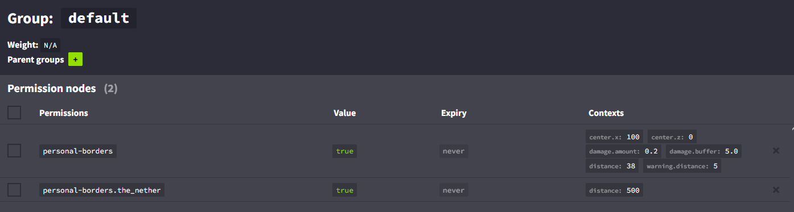

## Personal Borders  
Fabric mod that adds player-specific world borders using LuckPerms permissions.  

### Features
- Separate world borders for each player and each dimension
- Prevent players, players' projectiles, and players' pets from crossing the border
- Updated in real-time when permissions are changed

### Configuration
Personal Borders looks for next four permission nodes in LuckPerms:
- `personal-borders`: default world border, if dimension-specific border is not set
- `personal-borders.overworld`: overworld border
- `personal-borders.the_nether`: nether border
- `personal-borders.the_end`: end border

Parameters of the border are stored in the permission node as context values that are similar to [Vanilla world border command](https://minecraft.wiki/w/Commands/worldborder):
- `center.x`, `center.z`: coordinates of the border center
- `distance`: size of the border (diameter)
- `warning.distance`: distance from the border at which the player's screen starts to tint red
- `damage.amount`: damage dealt to the player per second per block when outside the border
- `damage.buffer`: distance from the border at which the player starts taking damage

Example:

[CurseForge](https://www.curseforge.com/minecraft/mc-mods/personal-borders), [Modrinth](https://modrinth.com/mod/personal-borders)

[Discord](https://discord.gg/UY4nhvUzaK)

This mod requires [Fabric API](https://modrinth.com/mod/fabric-api) and [LuckPerms](https://modrinth.com/plugin/luckperms) to be installed on the server.